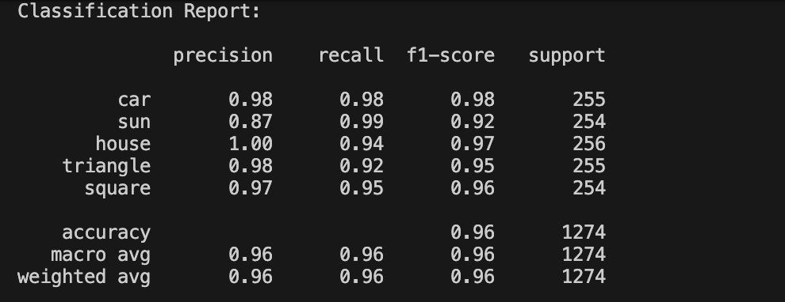
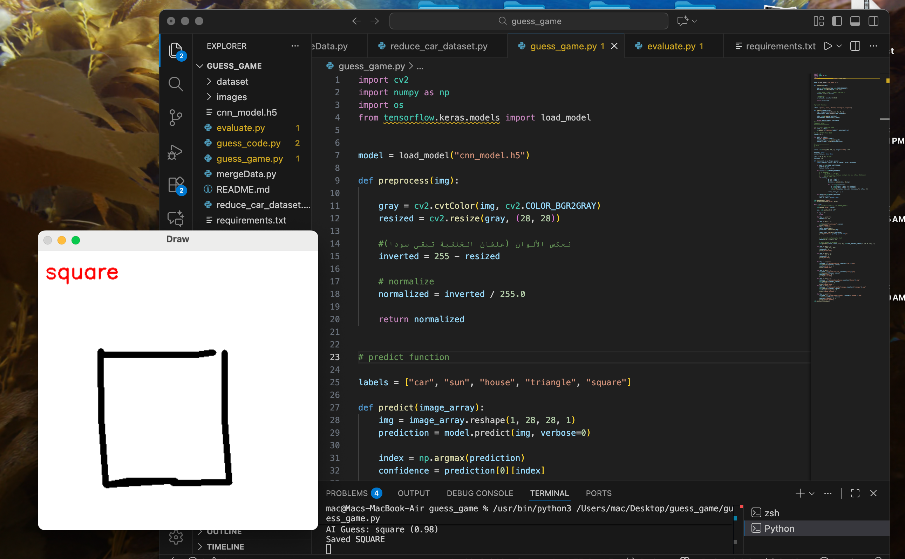
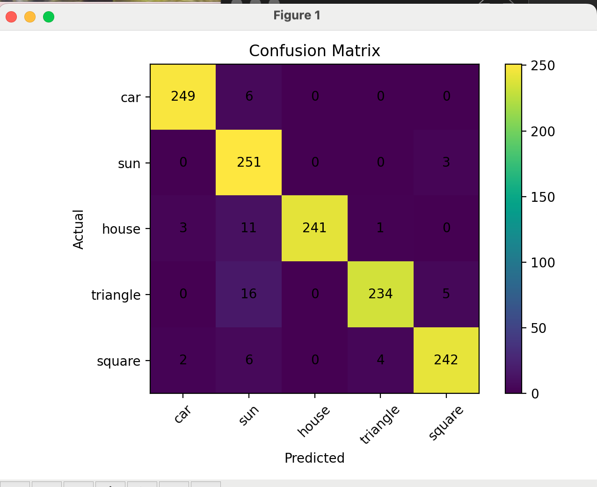
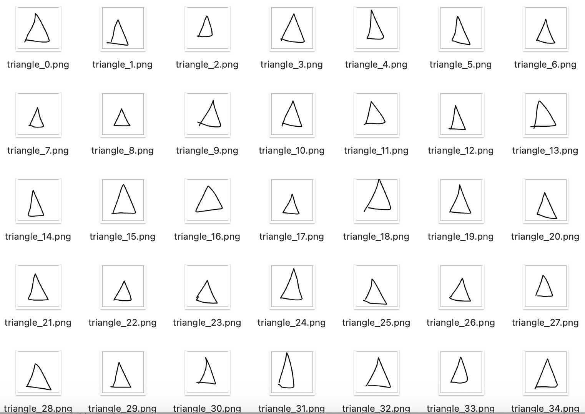
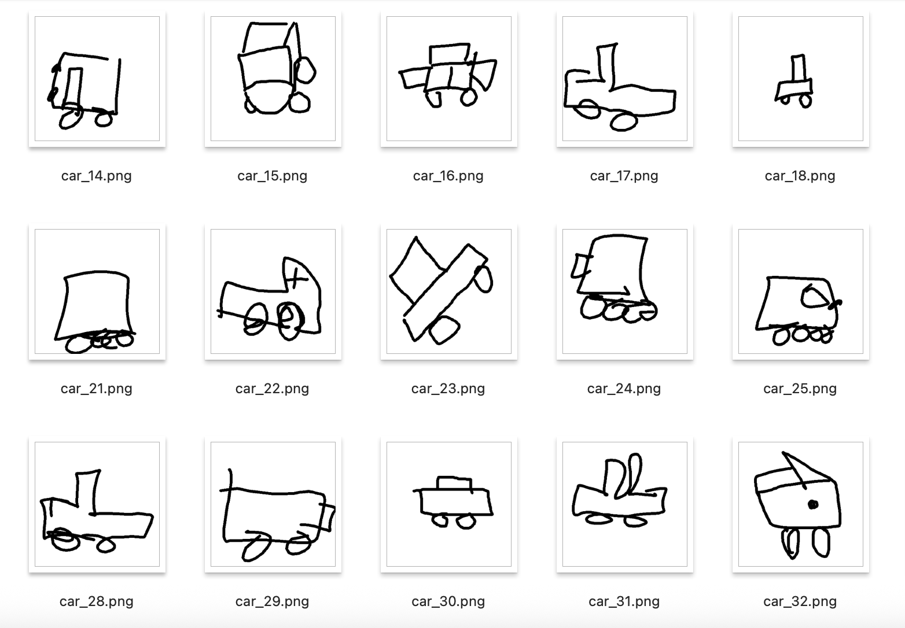
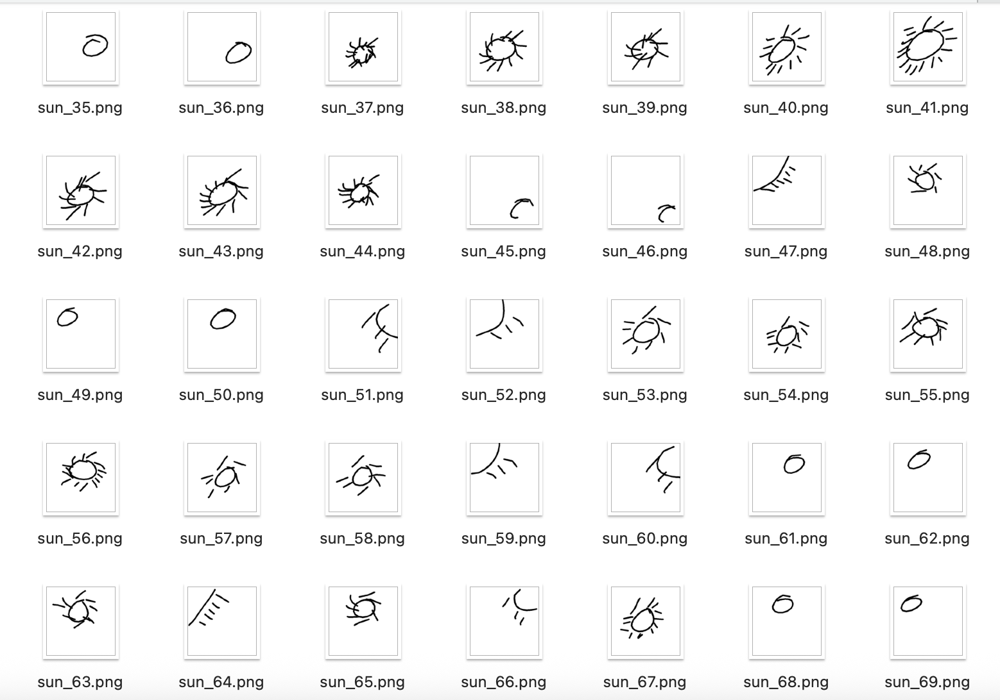

# 🎮 AI Drawing Guess Game

## 🚀 Overview
An interactive AI application where users can draw shapes and a deep learning model predicts the drawing in real-time.

## 🧠 Key Features
- Real-time drawing interface
- AI-powered shape recognition
- Custom dataset creation system

## ✍️ Dataset
The dataset was fully created and labeled manually by our team using a custom drawing tool.

### Classes:
- Car
- Sun
- House
- Triangle
- Square

## 🤖 Model
- Convolutional Neural Network (CNN)
- Input: 28x28 grayscale images

## 📊 Results
- ✅ Accuracy: **95.5%**
- Evaluated using confusion matrix and classification report

## 📊 Classification_Report



## 🖼️ Demo



## 📊 Confusion Matrix



## 🛠️ Tech Stack
- Python
- TensorFlow / Keras
- OpenCV
- NumPy
## Samples



## ▶️ How to Run

```bash
pip install -r requirements.txt
python evaluate.py
